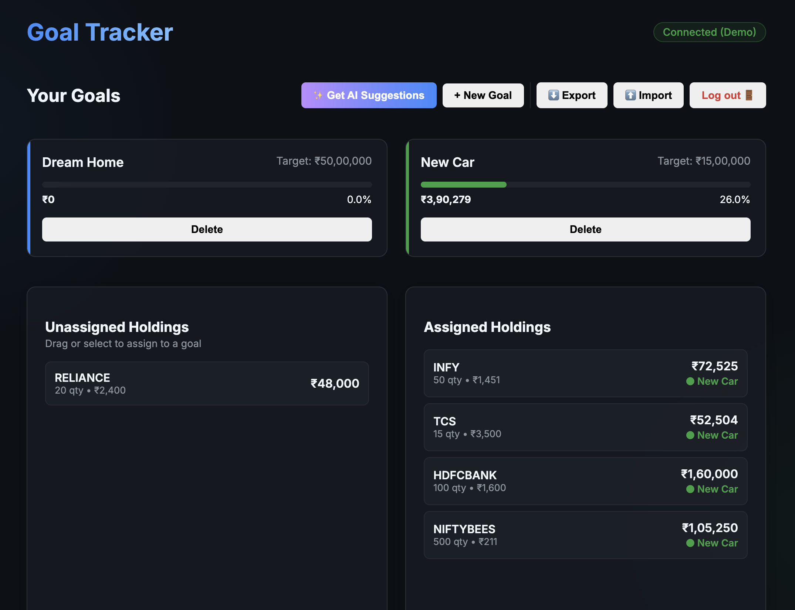

# Kite Goal-Based Investment Tracker 🎯


[](https://buymeacoffee.com/nimit2801)

A modern, aesthetically pleasing web application that interacts with your **Zerodha Kite** account to help you assign your stock holdings to specific life goals.

Powered by **Gemini AI** and **Ollama** (Local AI) to provide smart, diversified allocation suggestions based on your portfolio.



## ✨ Unique Features

- **Goal Management**: Create custom financial goals (e.g., "Dream Home", "Retirement") with target amounts and deadlines.
- **Smart Allocation**: Drag or assign your existing Zerodha holdings to these goals.
- **AI Suggestions**:
  - Uses **Google Gemini 3 (Flash Preview)** or **Ollama (Qwen/GPT-OSS)** to analyze your portfolio.
  - Smartly suggests which stocks fit which goal based on risk and timeline.
  - **Investment Personality**: Generates a motivational summary of your style.
  - **Interactive Loader**: Dynamic status updates (e.g., "Evaluating risk...") keep you engaged while AI thinks.
- **Privacy-First Architecture**:
  - **Zero Database**: User data (Goals & Assignments) is stored entirely in **LocalStorage** on your device.
  - **Portable Data**: **Export/Import** your configuration as a JSON file to move between devices.
- **Demo Mode**: One-click mock environment to test the app without a Zerodha account.
- **Real-time Tracking**: Live value updates fetched directly from Kite Connect.
- **Premium UI**: Dark-themed, glassmorphism design for a delightful user experience.

## 🚀 Getting Started

### Prerequisites

- **Node.js** (v18 or higher)
- **Zerodha Kite Connect Account** (API Key & Secret required)
- (Optional) **Google Gemini API Key** for Cloud AI features.
- (Optional) **Ollama** installed locally for Local AI features.

### Installation

1.  **Clone the repository**:

    ```bash
    git clone https://github.com/nimit2801/kite-goal-tracker.git
    cd kite-goal-tracker
    ```

2.  **Install dependencies**:

    ```bash
    npm install
    ```

3.  **Configure Environment**:
    Create a `.env` file in the root directory:

    ```bash
    cp .env.example .env
    ```

    Open `.env` and configure:

    ```env
    # Mandatory
    KITE_API_KEY=your_kite_api_key
    KITE_API_SECRET=your_kite_api_secret

    # Optional (for AI features)
    GEMINI_API_KEY=your_gemini_key
    OLLAMA_HOST=http://127.0.0.1:11434
    ```

4.  **Start the Server**:

    ```bash
    npm start
    ```

5.  **Access the App**:
    Open [http://localhost:3001](http://localhost:3001).

    > **Note**: On first run, you will be redirected to Zerodha for login. The app will create a `data/db.json` file to store your goals locally.

## 🤖 AI Setup

### Gemini (Cloud)

1.  Get a key from [Google AI Studio](https://aistudio.google.com/).
2.  Add it to `.env` as `GEMINI_API_KEY`.

### Ollama (Local)

1.  Download [Ollama](https://ollama.com/).
2.  Run a model (e.g., Qwen 2.5):
    ```bash
    ollama run qwen2.5:7b
    ```
3.  Ensure `OLLAMA_HOST` is set in `.env` (defaults to `http://127.0.0.1:11434`).

## 🛠️ Tech Stack

- **Backend**: Node.js, Express
- **Frontend**: Vanilla JS, HTML5, CSS3 (Glassmorphism)
- **APIs**: Kite Connect (Holdings), Google Generative AI (Gemini), Ollama (Local LLM)
- **Data**: JSON file storage (Simple & Zero-config)

## 🤝 Contributing

Contributions are welcome! Please read the [CONTRIBUTING.md](CONTRIBUTING.md) for details on our code of conduct, and the process for submitting pull requests.

## 📄 License

This project is licensed under the MIT License - see the [LICENSE](LICENSE) file for details.

---

_Built with ❤️ by [Nimit Savant](https://github.com/nimit2801)_
